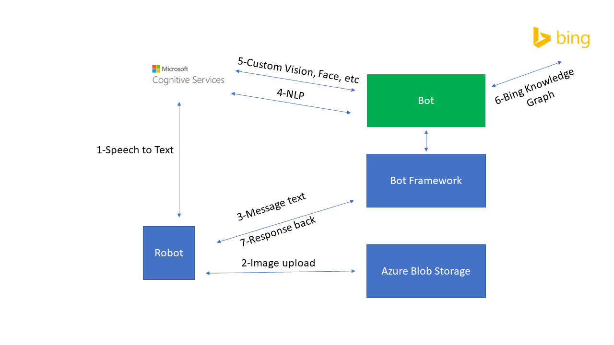

# zenbo-build
Source code for the bot prototype demoed at Build 2017 using [ASUS Zenbo](http://zenbo.asus.com "ASUS Zenbo") and Microsoft Cognitive Services.

This bot allows a few sample scenarios:

- Answering general knowledge base questions (e.g. "Who is Bill Gates?")
- Answering follow up questions (e.g. "Who is his wife/where is she from?")
- Making comments about what the robot can actually see (e.g. "This looks like a drawing, what is it?)

 
These are simple examples of how we can integrate a few different services (Microsoft Bot Framework, Microsoft Language Understanding Intelligent Service, Bing Knowledge Graph, Bing Speech, Custom Speech Recognition, Custom Vision API) in order to enable more natural conversational interfaces.

In a simplified way, this is the overall architecture:

the code in this repo doesn't cover the client side, the "robot" component, only the server side, the "bot" component.

Steps work as follow:

1. Robot listens and calls Microsoft Custom Speech Recognition API. This enables custom recognition of scenarios such as children talking or noisy environments

2. Robot uploads a snapshot of what its camera can see to an Azure Blob Storage

3. Robot then sends a transcription of what the user said (back from custom speech) to Bot Framework, via Bot Framework's DirectLine, including a link to the actual image.

4. Bot Framework calls Microsoft Language Understanding API (LUIS) so it can recognize the intent and entities provided

5. Depending on the findings from step 4, the Bot may also call custom vision API in order to recognize what was in the image when the user was talking to the robot

6. Also depending on step 4, the bot may decide to send the request to Bing Knowledge Graph API in order to attempt answering the user's question. Bing Knowledge Graph is currently offered as a partner only API and you can find out more at [bing.com/partners](http://www.bing.com/partners)

7. Bot then responds to the user

This is a very simple bot as the code will tell, but enables expanding to more interesting scenarios, for example:

- The robot could have different answers and behaviors if it realizes it is talking to a child instead of an adult

- The robot can make comments about what it sees and logs the metadata from it into a database so it can answer contextual and historical related questions such as "when was the last time you saw John around here?"

- With the message returned in step 7, we also bake additional details such as facial expressions or the HTML we want to display into the robot's user interface, so the user may decide to move away from speech back into a touch screen if needed

Authors: Mat Velloso, Chris Risner and Brandon Hurlburt 
